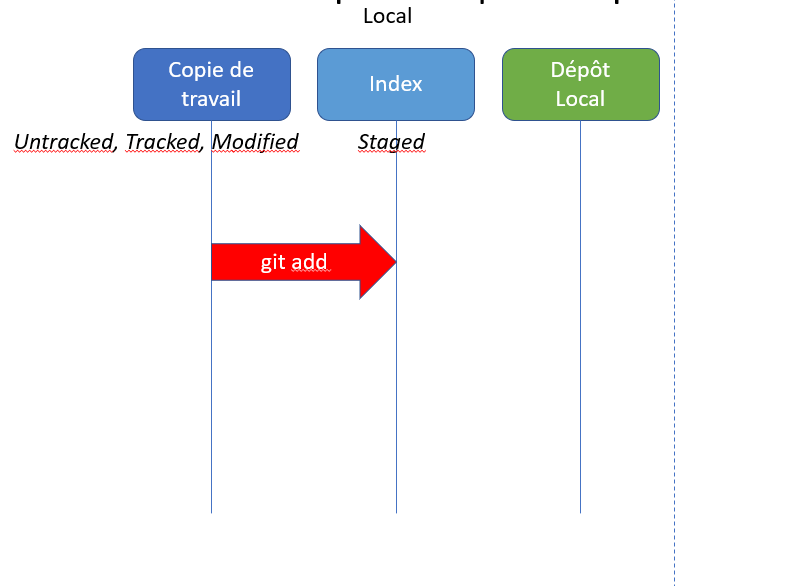
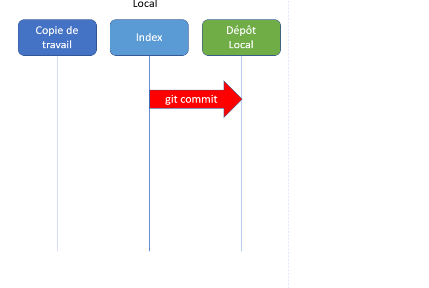

# Atelier sur git et github

git est un outil de gestion de version, de code source et/ou de documentation. Il permet de conserver l’historique des versions, de revenir en arrière. Il permet également de travailler à plusieurs sur un même jeu de fichiers.

git est un outil qui peut être complexe à prendre en main. Nous ne verrons ici qu’une petite partie de ses fonctionnalités.

[github](https://github.com/) est une plateforme qui permet aux développeurs de créer, gérer et partager leur code source. github utilise git pour le contrôle de version.  

Vous devez vous appuyer sur la documentation en ligne : https://docs.github.com/fr/get-started/start-your-journey/git-and-github-learning-resources

## Premiers pas sur github

1. s’identifier
2. créer un dépôt public (avec un README)
3. Modifier le README en ligne

## (zones de travail et état des fichiers)

En version très simplifiée :

<small>3 états de git</small>

<small>`git add`</small>

<small>`git commit`</small>

Je vous recommande cette visualisation interactive : [http://ndpsoftware.com/git-cheatsheet.html](http://ndpsoftware.com/git-cheatsheet.html)

## Pareil depuis son ordinateur

- un peu de mise en place

`git config --global user.name "Clément Plancq"`  
`git config --global user.email "clement.plancq@univ-tours.fr"`  

Créer un [Personal Access Token](https://docs.github.com/fr/authentication/keeping-your-account-and-data-secure/managing-your-personal-access-tokens#creating-a-personal-access-token-classic) sur Github
Settings > Developper Settings > Personal access tokens > Fine-grained tokens puis Generate new token

`git clone https://votre_depot`  

Faire une modification sur le fichier README.md  
`git add README.md`  
`git commit -m "Ma modification"`  
`git push`

## Même chose avec VSCode

Démo 

Vous pouvez installer l’extension [Git History](https://marketplace.visualstudio.com/items?itemName=donjayamanne.githistory) pour parcourir l’historique plus facilement

## Github Pages

(Settings > Pages)

Soit avec un fichier index.html soit index.md ou readme.md
Par défaut Pages utilise Jekyll pour générer un site statique à base de fichiers markdown

Dans les paramètres vous pouvez choisir de composer votre site à partir de la racine du dépôt ou depuis un dossier en particulier, `docs` par exemple.

Vous pouvez de cette façon créer et publier un site web statique depuis l’interface GitHub sur un navigateur

Chaque dépôt public a également un wiki intégré

## Travailler à plusieurs

`git pull` pour récupérer les changements du dépôt distant  
`git push` pour poster vos commits sur le dépôt distant  

Choisissez un ou une responsable par projet 
La responsable crée le dépôt  
La responsable ajoute les autres utilisateurs (Settings > Collaborators)

Utilisez des branches et des pull request : démo

## Pour aller plus loin sur git

- https://git-scm.com/docs (la doc officielle, la base)
- https://ohshitgit.com/ (Oh Shit, Git!?!)
- http://ndpsoftware.com/git-cheatsheet.html (cheatsheet interactive très bien faite)
- https://learngitbranching.js.org/ (exos interactifs sur les branches)
- https://onlywei.github.io/explain-git-with-d3/ (visualisations interactives sur les commandes git de base)
- https://www.atlassian.com/git/tutorials/setting-up-a-repository (les tutos git d’Atlassian, clairs et bien illustrés )
- https://marklodato.github.io/visual-git-guide/ (un guide très visuel)s
- https://grafikart.fr/formations/git (🙏 Graphikart)
